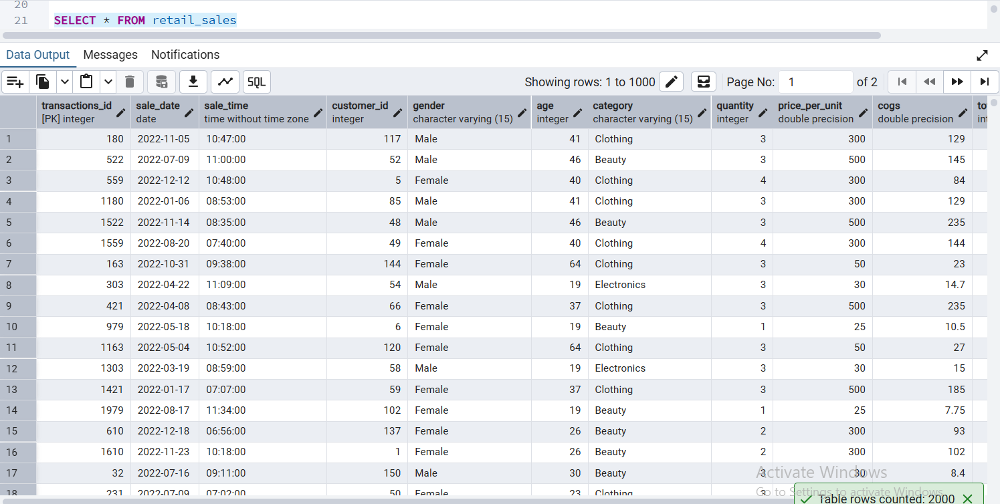
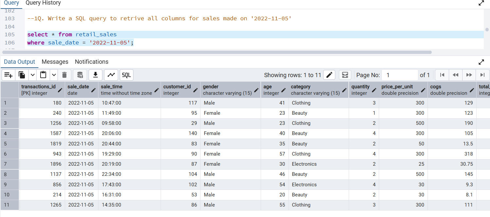
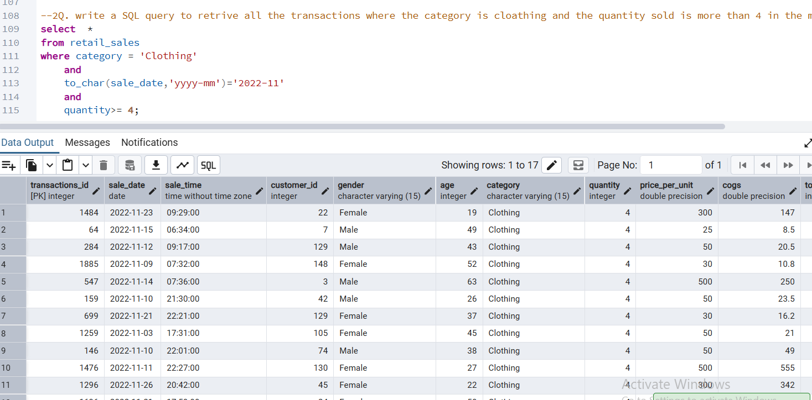
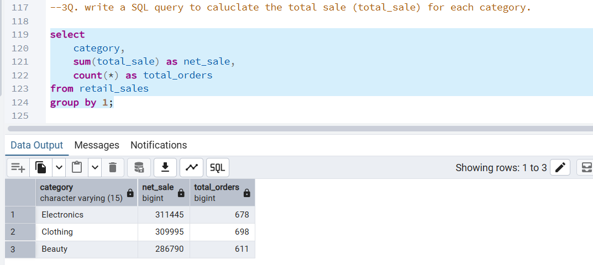

# Retail Sales Analysis SQL Project

## Project Overview

**Project Title**: Retail Sales Analysis  
**Level**: Beginner  
**Database**: `sql_project_1`

This project demonstrates SQL skills and techniques used by data analysts to explore, clean, and analyze retail sales data. It includes database setup, exploratory data analysis (EDA), and solving business problems using SQL queries.

This project is inspired by online learning resources and has been modified with my own understanding and improvements.

## Objectives

1. **Set up a retail sales database**: Create and populate a retail sales database with the provided sales data.
2. **Perform data cleaning**: Identify and remove any records with missing or null values.
3. **Conduct exploratory data analysis (EDA)**: Perform basic exploratory data analysis to understand the dataset.
4. **Solve business problems using SQL queries**: Use SQL to answer specific business questions and derive insights from the sales data.

## Project Structure

### 1. Database Setup

- **Database Creation**: The project starts by creating a database named `p1_retail_db`.
- **Table Creation**: A table named `retail_sales` is created to store the sales data. The table structure includes columns for transaction ID, sale date, sale time, customer ID, gender, age, product category, quantity sold, price per unit, cost of goods sold (COGS), and total sale amount.

```sql
CREATE DATABASE sql_project_1;

CREATE TABLE retail_sales
	(
		transactions_id	INT PRIMARY KEY,
		sale_date DATE,
		sale_time TIME,
		customer_id	INT,
		gender VARCHAR(15),
		age	INT,
		category VARCHAR(15),	
		quantiy	INT,
		price_per_unit FLOAT,	
		cogs FLOAT,
		total_sale INT
	);
```

### 2. Data Exploration & Cleaning

- **Record Count**: Determine the total number of records in the dataset.
- **Customer Count**: Find out how many unique customers are in the dataset.
- **Category Count**: Identify all unique product categories in the dataset.
- **Null Value Check**: Check for any null values in the dataset and delete records with missing data.

```sql
SELECT COUNT(*) FROM retail_sales;
SELECT COUNT(DISTINCT customer_id) FROM retail_sales;
SELECT DISTINCT category FROM retail_sales;

SELECT * FROM retail_sales
WHERE
	transactions_id IS NULL
	OR
	sale_date IS NULL
	OR
	sale_time IS NULL
	OR
	customer_id IS NULL
	OR
	gender IS NULL
	OR
	category IS NULL
	OR
	age is null
	or
	quantity IS NULL
	OR
	price_per_unit IS NULL
	OR
	cogs IS NULL
	OR
	total_sale IS NULL;


DELETE FROM retail_sales
WHERE
	transactions_id IS NULL
	OR
	sale_date IS NULL
	OR
	sale_time IS NULL
	OR
	customer_id IS NULL
	OR
	gender IS NULL
	OR
	age is null
	or
	category IS NULL
	OR
	quantity IS NULL
	OR
	price_per_unit IS NULL
	OR
	cogs IS NULL
	OR
	total_sale IS NULL;
```

### 3. Data Analysis & Findings

The following SQL queries were developed to answer specific business questions:

1. **Write a SQL query to retrieve all columns for sales made on '2022-11-05**:
```sql
SELECT *
FROM retail_sales
WHERE sale_date = '2022-11-05';
```


2. **Write a SQL query to retrieve all transactions where the category is 'Clothing' and the quantity sold is more than 4 in the month of Nov-2022**:
```sql
SELECT 
  *
FROM retail_sales
WHERE 
    category = 'Clothing'
    AND 
    TO_CHAR(sale_date, 'YYYY-MM') = '2022-11'
    AND
    quantity >= 4
```

3. **Write a SQL query to calculate the total sales (total_sale) for each category.**:
```sql
SELECT 
    category,
    SUM(total_sale) as net_sale,
    COUNT(*) as total_orders
FROM retail_sales
GROUP BY 1
```

4. **Write a SQL query to find the average age of customers who purchased items from the 'Beauty' category.**:
```sql
SELECT
    ROUND(AVG(age), 2) as avg_age
FROM retail_sales
WHERE category = 'Beauty'
```

5. **Write a SQL query to find all transactions where the total_sale is greater than 1000.**:
```sql
SELECT * FROM retail_sales
WHERE total_sale > 1000
```

6. **Write a SQL query to find the total number of transactions (transaction_id) made by each gender in each category.**:
```sql
SELECT 
    category,
    gender,
    COUNT(*) as total_trans
FROM retail_sales
GROUP 
    BY 
    category,
    gender
ORDER BY 1
```

7. **Write a SQL query to calculate the average sale for each month. Find out best selling month in each year**:
```sql
SELECT 
       year,
       month,
    avg_sale
FROM 
(    
SELECT 
    EXTRACT(YEAR FROM sale_date) as year,
    EXTRACT(MONTH FROM sale_date) as month,
    AVG(total_sale) as avg_sale,
    RANK() OVER(PARTITION BY EXTRACT(YEAR FROM sale_date) ORDER BY AVG(total_sale) DESC) as rank
FROM retail_sales
GROUP BY 1, 2
) as t1
WHERE rank = 1
```

8. **Write a SQL query to find the top 5 customers based on the highest total sales **:
```sql
SELECT 
    customer_id,
    SUM(total_sale) as total_sales
FROM retail_sales
GROUP BY 1
ORDER BY 2 DESC
LIMIT 5
```

9. **Write a SQL query to find the number of unique customers who purchased items from each category.**:
```sql
SELECT 
    category,    
    COUNT(DISTINCT customer_id) as cnt_unique_cs
FROM retail_sales
GROUP BY category
```

10. **Write a SQL query to create each shift and number of orders (Example Morning <12, Afternoon Between 12 & 17, Evening >17)**:
```sql
WITH hourly_sale
AS
(
SELECT *,
    CASE
        WHEN EXTRACT(HOUR FROM sale_time) < 12 THEN 'Morning'
        WHEN EXTRACT(HOUR FROM sale_time) BETWEEN 12 AND 17 THEN 'Afternoon'
        ELSE 'Evening'
    END as shift
FROM retail_sales
)
SELECT 
    shift,
    COUNT(*) as total_orders    
FROM hourly_sale
GROUP BY shift
```

## Project Screenshots

### Data Preview


### Sales on Specific Date


### Filtered Sales (Category & Quantity)


### Total Sales by Category


## Findings
- Sales are distributed across multiple product categories such as Clothing and Beauty.
- High-value transactions indicate premium customer segments.
- Monthly trends help identify peak sales periods.
- Customer-level analysis helps identify top-performing customers.


## What I Learned

- Writing SQL queries for real-world business problems
- Data cleaning and preprocessing using SQL
- Aggregation functions and GROUP BY usage
- Window functions like RANK()
- Extracting business insights from raw data

## Conclusion

This project demonstrates my ability to use SQL for data cleaning, exploration, and query writing on a retail dataset. 
I performed operations such as filtering, aggregation, and grouping to analyze the data. 
The project focuses on building a strong foundation in writing efficient SQL queries for real-world datasets. 
Overall, it helped me improve my understanding of SQL concepts used in data analysis.

## How to Use

1. **Clone the Repository**: Clone this project repository from GitHub.
2. **Set Up the Database**: Run the SQL scripts provided in the `database_setup.sql` file to create and populate the database.
3. **Run queries to analyze data**: Use the SQL queries provided in the `analysis_queries.sql` file to perform your analysis.
4. **EModify queries to explore additional insights**: Feel free to modify the queries to explore different aspects of the dataset or answer additional business questions.

## Author - Ajay Boddu

This project is part of my data analyst portfolio. I built and modified this project to strengthen my SQL and data analysis skills.

If you have any suggestions or opportunities, feel free to connect with me on LinkedIn.
